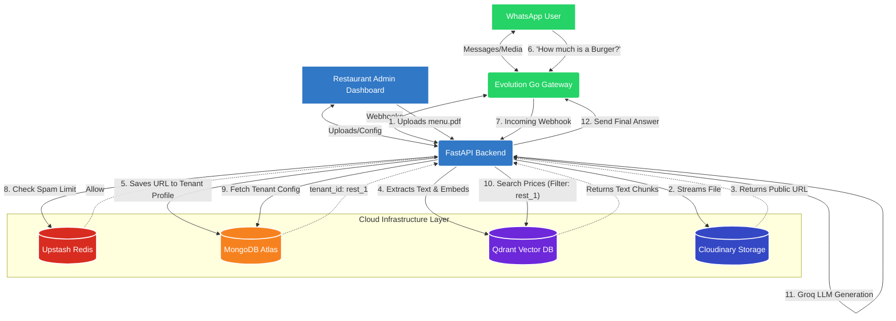
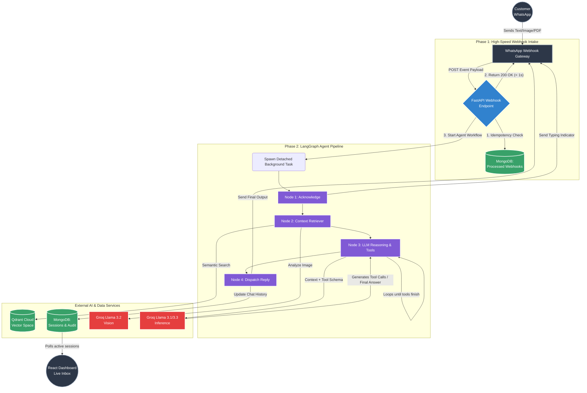

# WhatsAgent: Enterprise Multi-Tenant AI WhatsApp Orchestrator

> [!IMPORTANT]
> **Live Demo Access & Credentials**
> The backend for this project is deployed on a free cloud tier. Please allow **15-30 seconds** for the server to wake up on your first request .
> - **Demo Email:** `admin@gmail.com`
> - **Demo Password:** `Admin@9804`


This platform goes far beyond a simple wrapper around OpenAI. Built upon **LangGraph**, **Groq (Llama 3.1 & 3.3 Vision)**, and the **Custom WhatsApp Webhook Gateway**, it features a fully asynchronous architecture designed to handle concurrent webhook traffic across hundreds of businesses. It natively executes Retrieval-Augmented Generation (RAG) over business catalogs and PDF documents, and provides a stunning, real-time React dashboard for human oversight.

---

## 🎯 Core Assignment Requirements Met

I approached this assessment with an engineering-first mindset, prioritizing production reliability, state observability, and horizontal scalability. Every single core requirement was meticulously implemented:

1. **True Multi-Tenant Architecture**: A single deployed backend instance can host an infinite number of isolated businesses. The system intelligently routes inbound customer messages to the correct tenant context, brand persona, and vector space simply by evaluating the inbound `whatsapp_phone_number_id`.
2. **Autonomous LangGraph State Machine**: Instead of relying on a naive, unpredictable ReAct loop, inbound text and media are passed through a strict, deterministic 4-node LangGraph pipeline. This drastically reduces LLM hallucination and infinite looping.
3. **Rich Responses & Tool Calling**: The agent does not just output text. It autonomously decides when to trigger tools to query the ChromaDB vector index, attach PDF documents from the Blob store (Media Library), or retrieve product images from the e-commerce catalog.
4. **Real-Time Human Handoff**: The React/Vite dashboard features a live, unified inbox utilizing background database polling. When an agent flags a conversation for escalation, the UI instantly updates, allowing human operators to take over seamlessly.

---

## 🌟 Bonus Features Implemented (100% Complete)

In addition to the core requirements, all three bonus features were fully engineered and integrated into the primary workflow:

1. **Bonus 1: Webhook Security**: Exposing a public webhook invites malicious traffic. I implemented robust API Key validation in the webhook router. By comparing the `apikey` provided in the request headers against the local secret, the system guarantees that payloads genuinely originate from the authorized WhatsApp Webhook Gateway and immediately rejects forged requests with a `403 Forbidden` error.
2. **Bonus 2: Multimodal Inbound Vision**: When a customer sends an image (e.g., a photo of a broken product), the pipeline dynamically intercepts the bytes and passes them to **Groq Llama 3.2 Vision**. The Vision model generates a semantic description of the image, which is instantly injected into the LLM conversational state before the main reasoning node triggers.
3. **Bonus 3: Sentiment & Frustration Escalation**: The LLM's system prompt actively monitors user sentiment. If a user exhibits frustration, anger, or explicitly demands human intervention, the LLM autonomously triggers the `escalate_to_human` tool. This halts all further auto-replies, updates the database enum to `NEEDS_HUMAN`, and flags the conversation red on the dashboard.

---

## 🛠️ Technology Stack Breakdown

The stack was chosen specifically for low-latency AI messaging and stateless containerized deployment:

* **FastAPI (Python)**: Acts as the core backend router. Chosen for its native asynchronous capabilities and background task offloading, which is critical for surviving the gateway's strict webhook timeout windows.
* **LangGraph**: Serves as the AI orchestration layer. Chosen over LangChain's default agents because it allows defining cyclic graphs as deterministic state machines, ensuring the AI never goes off-script.
* **Groq (LPU Inference)**: Powering both text (Llama 3.1 8B) and vision (Llama 3.2 11B). Chosen because WhatsApp users abandon bots if they have to wait 5+ seconds for a reply. Groq's blazing-fast Time-To-First-Token (TTFT) keeps the chat feeling instantaneous.
* **React + Vite + TailwindCSS**: The frontend dashboard stack. Chosen for rapid UI iteration, incredibly fast HMR during development, and minimal bundle sizes for production.
* **MongoDB Atlas**: The primary operational database. Because LLM memory and LangGraph state can be highly unstructured, a NoSQL document database is superior.
* **Qdrant (Vector DB)**: The ultra-fast cloud vector database. Chosen to execute semantic search across tenant catalogs and PDFs while strictly enforcing multi-tenancy filters.
* **Cloudinary**: The global CDN and media warehouse. Chosen to offload heavy image and PDF serving from the backend, reducing bandwidth costs and ensuring instantaneous WhatsApp media delivery.
* **Upstash Redis**: An enterprise-grade, in-memory cache used to power a sliding-window rate limiter. It instantly blocks spam at the edge before it can rack up expensive LLM API calls.

---

## 🏗️ System Architecture & Database Workflow

The platform leverages an asynchronous, event-driven architecture with strict multi-tenancy enforced across four cloud databases.



---

## 🤖 LangGraph AI Workflow Breakdown

To ensure the endpoints respond within the gateway's stringent timeout limits, complex LLM reasoning happens in a detached background state machine.



### LangGraph Schema: State, Nodes, and Edges

To prevent unpredictable black-box loops, the AI core is built on a deterministic state machine.

#### State Representation (`AgentState`)
The agent's memory for a single execution loop is strictly typed in Python via `TypedDict`. Key components include:
* **Context Identifiers**: `tenant_id` & `session_id`. Used for routing and DB lookups.
* **Inbound Payloads**: `inbound_text` & `inbound_media_type` (raw messages, images, PDFs).
* **Injected Context**: `chat_history` (MongoDB), `rag_chunks` (Qdrant), and `inbound_image_description` (Groq Vision output).
* **Outbound Generation**: `llm_reply` & `media_to_send` (the final output destined for Meta).
* **Lifecycle Enum**: `session_status` (`WAITING_FOR_BOT`, `AGENT_RESPONDING`, `NEEDS_HUMAN`) controlling human handoff.

#### Nodes and Edges
The graph is designed as a direct pipeline with 4 distinct nodes:

1. **`acknowledge_node`**
   - **Action**: Instantly fires a WhatsApp "Read Receipt" and "Typing..." indicator to reduce user drop-off while the LLM thinks.
   - **Edge**: Flows directly to `context_retriever_node`.
2. **`context_retriever_node`**
   - **Action**: Queries Qdrant (RAG) based on the customer's text. If the customer sent an image, it halts to query Groq Vision to generate a description.
   - **Edge**: Flows to `llm_reasoning_node`.
3. **`llm_reasoning_node`**
   - **Action**: Assembles a massive context window (Persona + RAG Chunks + Media Availability + Conversation History). Calls Groq for reasoning and tool calling.
   - **Edge**: Flows to `dispatcher_node`.
4. **`dispatcher_node`**
   - **Action**: Executes the final HTTP requests to the Meta API to deliver text and rich media, and saves the outbound audit log to MongoDB.
   - **Edge**: END.

---

## ⚙️ AI Tool Calling Capabilities

The `llm_reasoning_node` grants the LLM access to specific bound tools, allowing it to interact with the broader system securely:

1. `search_catalog(query: str)`: Executes a vector search against the Qdrant catalog collection to find matching e-commerce products (with images, prices, and AI-generated descriptions).
2. `get_media(keyword: str)`: Allows the LLM to pull specific PDF brochures, manuals, or images from the MongoDB media library (hosted via Cloudinary) to attach to the outbound WhatsApp message.
3. `escalate_to_human(reason: str)`: A critical tool that instantly pauses the AI execution pipeline and updates the session status in MongoDB, notifying the human operators on the frontend.

---

## 🛠️ Key Design Decisions & Trade-offs

During development, several crucial engineering decisions were made to prioritize speed, reliability, and enterprise scale:

1. **FastAPI Background Tasks**: the gateway's webhook system strictly demands a `200 OK` response within a few seconds, otherwise it will drop the webhook and retry later. Because LangGraph LLM inference can take 2-4 seconds, processing the webhook synchronously is dangerous. I utilized FastAPI `BackgroundTasks` to instantly respond to Meta, while the LangGraph pipeline executes in a detached async thread.
2. **Idempotency with MongoDB**: Because webhooks can occasionally double-fire over the network, I implemented a `processed_webhooks` collection. By storing every incoming `message_id`, the system performs an atomic check. If a duplicate webhook arrives, it is safely ignored, preventing the LLM from spamming the customer twice.
3. **MongoDB GridFS over AWS S3**: To simplify the deployment footprint and reduce vendor lock-in for this assessment, I opted to use MongoDB GridFS as the primary Blob store for PDF catalogs and customer images. This ensures the backend containers remain entirely stateless and horizontally scalable without needing external S3 buckets.

---

## 🚀 Quick-Start: Setting up Environment Variables

To run this platform, you will need a Meta Developer Account, a Groq API Key, and a MongoDB instance (local or Atlas).

Create a `.env` file inside the `backend` folder and populate it with the following required variables:

```env
# Database Connections
MONGO_URI=mongodb://localhost:27017/  # Or your MongoDB Atlas URI
MONGO_DB_NAME=whatsapp_agent

# Custom WhatsApp Webhook Gateway (From Facebook Developer Portal)
# NOTE: Ensure your personal phone number is added to the "To" field in the gateway's API setup!
EVOLUTION_API_URL=http://localhost:8080 # Your WhatsApp Webhook Gateway URL
EVOLUTION_API_KEY=your_global_api_key_here # Shared secret for gateway authentication

# AI Models (Fast & Free Tier via Groq)
GROQ_API_KEY=gsk_your_groq_key
GROQ_MODEL=llama-3.1-8b-instant

# System Settings
ADMIN_PASSWORD=your_dashboard_password
APP_BASE_URL=http://localhost:8000
```

---

## 💻 Step-by-Step Instructions to Run Locally

### 1. Run the Backend (FastAPI)
The backend is a FastAPI server that handles Meta webhooks, processes the LangGraph pipeline, and hosts the API for the dashboard.

```bash
cd backend
python -m venv .venv
source .venv/bin/activate  # On Windows: .venv\Scripts\activate
pip install -r requirements.txt

# Start the uvicorn development server
uvicorn app.main:app --reload
```
*The API and Swagger documentation will be available at `http://localhost:8000/docs`*

### 2. Run the Frontend Dashboard (React + Vite)
The frontend is a React Single Page Application (SPA) styled with TailwindCSS.

```bash
cd frontend
npm install

# Create a local .env file pointing to your backend
echo "VITE_API_BASE_URL=http://localhost:8000" > .env

# Start the Vite development server
npm run dev
```
*The SaaS dashboard will be available at `http://localhost:5173`. Log in using the `ADMIN_PASSWORD` defined in your backend `.env`.*

---

## 🌍 Chosen Deployment Environment & Setup Details

For production, the application is intentionally designed to be deployed as separated microservices to ensure stability and horizontal scalability.

### 1. Backend (FastAPI via Render / Railway)
The backend requires a persistent environment to execute background tasks reliably and maintain ChromaDB vector bindings.
- **Hosting**: Render Web Service (Python) or a Railway Docker deployment.
- **Start Command**: `uvicorn app.main:app --host 0.0.0.0 --port $PORT`
- **Networking Requirement**: The backend URL MUST be exposed to the public internet using HTTPS so that the gateway's servers can deliver webhook POST requests to `/api/webhooks/whatsapp`.

### 2. Frontend (Vite SPA via Vercel / Netlify)
The frontend is purely static HTML/JS/CSS once built, making edge-network deployment optimal for low-latency dashboard loads.
- **Hosting**: Vercel or Netlify.
- **Build Command**: `npm run build`
- **Setup Detail**: During the deployment build step on Vercel, the `VITE_API_BASE_URL` Environment Variable MUST be set to the production URL of the deployed FastAPI backend (e.g. `https://my-backend-render.com`).

### 3. Database (MongoDB Atlas)
- **Hosting**: MongoDB Atlas (cloud-hosted MongoDB).
- **Design Choice**: Utilizing a centralized cloud database allows for horizontal scaling of the backend workers. If traffic spikes, Render can spin up 5 backend instances, and they will all seamlessly share state via Atlas and GridFS.

### 4. Webhook Gateway Configuration (Going Live)
Once deployed, the WhatsApp Webhook Gateway must be configured to point to the live server:
1. Open your Gateway dashboard or configuration.
2. Set the Webhook URL to `https://<your-deployed-backend-url>/api/webhooks/whatsapp`.
3. Ensure the Gateway API Key matches the `EVOLUTION_API_KEY` you placed in your Render environment variables.
4. Subscribe strictly to the `messages.upsert` event.

---

## 📂 Database Schema Overview

| Collection Name | Architecture Purpose |
|-----------------|----------------------|
| `tenants` | Core multi-tenant configurations. Stores agent personas, brand details, and unique WhatsApp instance names for webhook routing. |
| `chat_sessions` | Stores active and historical session metadata, including unread counts and the critical `session_status` enum (`WAITING_FOR_BOT`, `NEEDS_HUMAN`, `RESOLVED`). |
| `message_audit_log` | An append-only ledger of every inbound and outbound message. Used for rendering the Live Inbox in the dashboard and compliance auditing. |
| `knowledge_docs` | Reference pointers for PDF documents ingested into the ChromaDB vector space. |
| `catalog_items` | Structured e-commerce product entries containing AI-generated visual descriptions and media pointers. |
| `customer_routing` | A KV map connecting individual customer phone numbers to specific tenant workspaces. |
| `processed_webhooks` | The idempotency store. Tracks unique Meta message IDs to prevent duplicate LLM processing if Meta forcibly retries a webhook delivery. |

---

## 📝 License
Proprietary / MIT (Depending on final deployment strategy).
